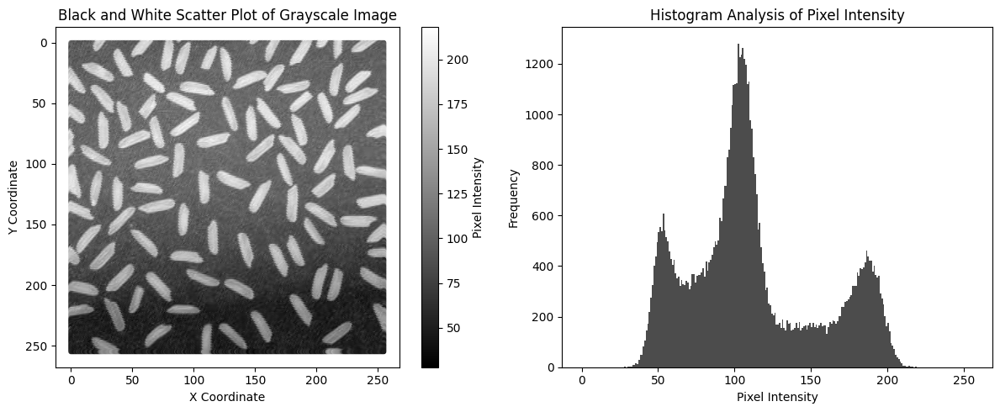
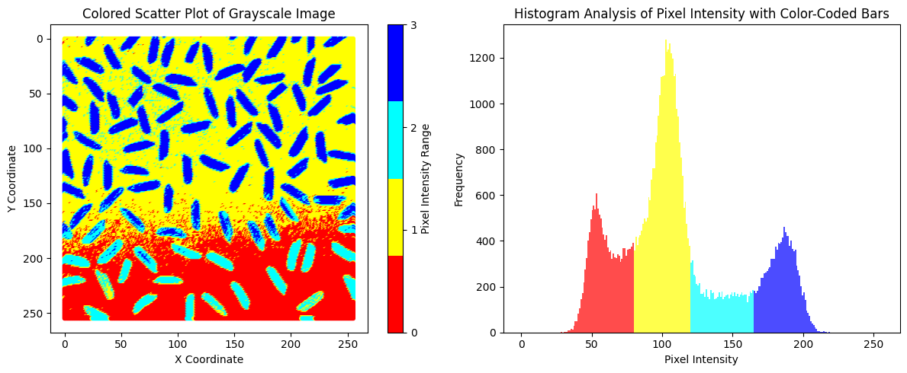

+++ {"part": "abstract"}

In this workshop, you will learn the tips and tricks on how to use centroid based clustering algorithms to analyse your spatial data. Using examples you will see how clustering can help to understand spatial patterns in several example datasets, including synthetic and real geophysical data. You will learn how clustering can be used to give insight into temporal changes in the landscape and the final example will show how clustering can combine data from different remotely sensed platforms. With the help of an online Google Colab notebook, you will also have the opportunity to try clustering on your data. Bring along some example dataset to try!

+++

## Prerequisites

Access to a Google Account and email (all code is run in Google Colab, but no coding experience necessary). If you want to try clustering on your own dataset, please bring it along. Prepare it in .CSV format with columns organised as `X_Coordinate, Y_Coordinate, Data1, Data 2, …, Data N`.

Below are examples of clustering in action! A grey scale image is grouped into 4 classes.

```{figure}


```
